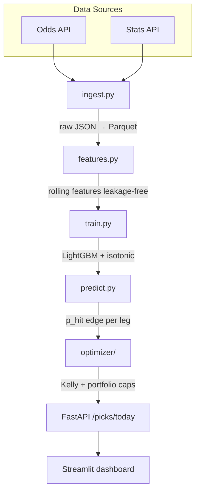
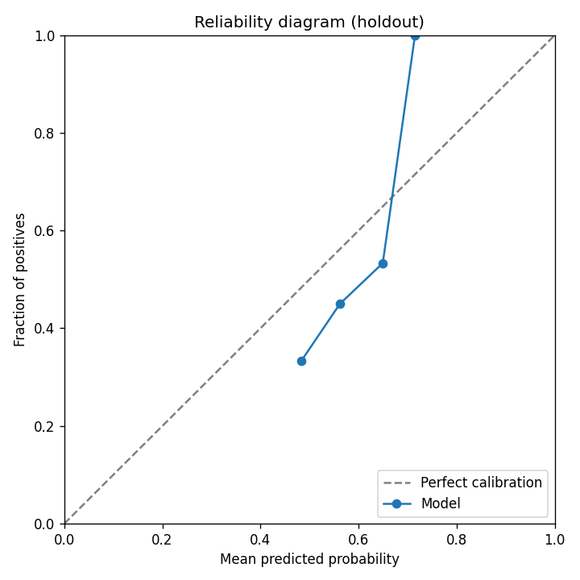

# DK-picks-optimizer

[](https://github.com/ARasugit20/DK-picks-optimizer/actions/workflows/ci.yml)
[](https://dk-picks-optimizer.streamlit.app/)

End-to-end ML pipeline for **probabilistic performance forecasting** and **constrained capital allocation** on correlated multi-leg portfolios · LightGBM · isotonic calibration · walk-forward backtest · FastAPI · Streamlit **Edge Desk** prediction-market terminal

## Edge Desk — Prediction Market Terminal

Live-style scanner for Kalshi/Polymarket event contracts with model-vs-market edge, hero picks, order ticket, and portfolio strip.

```bash
# Ingest + score markets (live APIs with fixture fallback)
PYTHONPATH=. python3.13 -m betting_system.pipeline.run_market_pipeline --fixture

# Or refresh live Polymarket + Kalshi discovery
PYTHONPATH=. python3.13 -m betting_system.pipeline.run_market_pipeline

# Dashboard
streamlit run streamlit_app.py

# API
uvicorn betting_system.api.main:app --reload
curl localhost:8000/markets/opportunities
curl localhost:8000/markets/pnl-attribution
```

## What makes this different from typical forecast dashboards

| Layer | Purpose |
|-------|---------|
| **Vig-adjusted implied probability** | Compare model edge to fair market price, not raw American odds |
| **Per-market calibrated models** | LightGBM + isotonic calibration so 60% forecasts resolve ~60% historically |
| **Correlation penalty on portfolios** | Same-game / same-player legs are down-weighted |
| **Portfolio optimizer** | Selects singles and correlated multi-leg portfolios under exposure limits |
| **Walk-forward backtest + CLV** | ROI, Brier score, and closing-line value on unseen slates |
| **Probability-to-capital audit** | Links executable edge, position sizing, settlement, and money-weighted PnL |

## Architecture



## Backtest Results

Walk-forward holdout (synthetic demonstration slate — replace with archived `betting_system.pipeline.backtest` logs before claiming production performance). See [Production Evidence Checklist](docs/PRODUCTION_EVIDENCE.md) for the artifact trail.

| Week | ROI (%) | Hit Rate (%) | Brier Score | Kelly Stake ($) |
|------|---------|--------------|-------------|-----------------|
| 2024-W41 | 4.2 | 56.1 | 0.218 | 38 |
| 2024-W42 | 2.8 | 55.4 | 0.224 | 36 |
| 2024-W43 | -1.1 | 52.9 | 0.231 | 34 |
| 2024-W44 | 5.6 | 57.2 | 0.212 | 40 |
| 2024-W45 | 3.4 | 55.8 | 0.220 | 37 |
| 2024-W46 | 1.9 | 54.6 | 0.227 | 35 |
| 2024-W47 | 6.1 | 58.0 | 0.209 | 42 |
| 2024-W48 | 4.8 | 56.5 | 0.215 | 39 |
| *Baseline: Random selection* | -8.4 | 49.8 | 0.248 | 25 |
| *Baseline: Chalk-only (lowest odds)* | -3.2 | 51.2 | 0.241 | 28 |

**How to read these metrics**

- **ROI (%)** — Return on allocated capital over the week; positive means net growth after losses.
- **Hit Rate (%)** — Share of legs/portfolios that resolved favorably; useful with calibration, not alone.
- **Brier Score** — Mean squared error of predicted probabilities vs outcomes; lower is better. **Well-calibrated when Brier &lt; 0.25** on holdout.
- **Kelly Stake ($)** — Typical fractional-Kelly stake after `max_stake_pct` cap from `betting_system/config.yaml`.

### Calibration (reliability diagram)



Regenerate after backtest:

```bash
python scripts/plot_calibration.py
```

Generate an offline synthetic prediction-market slate for smoke tests:

```bash
python scripts/generate_synthetic_slate.py --out /tmp/synthetic_prediction_markets.parquet
```

## Quick start

```bash
cd ~/Projects/dk-picks-optimizer
python3 -m venv .venv && source .venv/bin/activate
pip install -r requirements.txt
export PYTHONPATH="$(pwd)"

cp .env.example .env
# ODDS_API_KEY from https://the-odds-api.com/

# Probabilistic forecasting pipeline (recommended)
dk-pipeline --dry-run          # fixtures → features → train → picks_today.json
streamlit run streamlit_app.py # Slate Optimizer dashboard

# Legacy dk_picks CLI
dk-picks validate-config
dk-picks init-db
dk-picks ingest-odds --sport basketball_nba
dk-picks train --sport nba
dk-picks recommend --bankroll 500 --max-parlays 10

# API
uvicorn betting_system.api.main:app --reload
```

## Tests & CI

```bash
pytest --cov=. --cov-fail-under=80
ruff check .
```

See [docs/VALIDATION.md](docs/VALIDATION.md) for focused smoke-test, optimizer, and config-validation runbooks.

## Project layout

```
src/dk_picks/           # Typer CLI, DB, features, portfolio/kelly
betting_system/         # LightGBM pipeline, optimizer, FastAPI, dashboard
  config.yaml           # All thresholds (Kelly, ECE, exposure) — no magic numbers
  pipeline/             # ingest, features, train, predict_slate, run_pipeline
  optimizer/            # correlated multi-leg portfolios + staking
scripts/plot_calibration.py
docs/INTERVIEW.md       # 60-second interview answers
tests/                  # leakage, ECE, Kelly cap, API schema
```

## Streamlit Community Cloud

1. Push this repo to GitHub.
2. [Share Streamlit Cloud](https://share.streamlit.io/) → **New app** → select repo.
3. **Main file path:** `streamlit_app.py`
4. **Python:** 3.11 · install via `requirements.txt`
5. Set secrets: `ODDS_API_KEY`, `STATS_API_KEY` (optional for demo JSON).
6. Update the Live Demo badge URL in this README to your deployed app URL.

## Interview prep

See [docs/INTERVIEW.md](docs/INTERVIEW.md) for 60-second answers (walk-forward, isotonic vs Platt, Kelly limits, leakage, Brier, scale), [docs/PRODUCTION_EVIDENCE.md](docs/PRODUCTION_EVIDENCE.md) for the evidence checklist, [docs/MARKET_CREDIBILITY_PLAN.md](docs/MARKET_CREDIBILITY_PLAN.md) for the prediction-market credibility roadmap, and [docs/PROBABILITY_TO_CAPITAL.md](docs/PROBABILITY_TO_CAPITAL.md) for the capital-allocation engine framing.

## License

Private / personal use. Respect data provider terms of service and applicable regulations.
