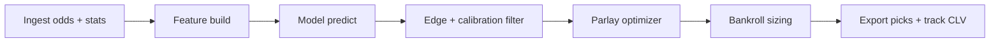

# DK-picks-optimizer

ML pipeline for DraftKings-style sportsbook picks: player/team features, market odds, calibrated win probabilities, bankroll sizing (fractional Kelly), and **correlation-aware parlay selection**.

## What makes this different from typical "pick" tools

| Layer | Purpose |
|-------|---------|
| **Vig-adjusted implied probability** | Compare model edge to *fair* market price, not raw American odds |
| **Per-market calibrated models** | LightGBM + isotonic calibration so 60% predictions win ~60% historically |
| **Correlation penalty on parlays** | Same-game / same-team legs are down-weighted (most apps ignore this) |
| **Portfolio optimizer** | Picks a *set* of singles/parlays under bankroll + max exposure, not just top EV legs |
| **Backtest + CLV tracking** | Measures ROI, Brier score, and closing-line value — the real sharp metrics |

## Realistic expectations

Sportsbooks build lines with large teams and vig (~4–10% on parlays). **No honest system guarantees 7–8/10 parlay wins.** Variance is high; long-term **positive expected value (EV)** and **disciplined bankroll** are the goals.

This project optimizes for:

1. **High-confidence singles** (target: 55–58%+ on spreads/totals where you have edge)
2. **Fewer, higher-quality parlays** (2–3 legs, low correlation)
3. **Stop betting** when model edge &lt; threshold or bankroll drawdown limits hit

Hit rate improves when you **filter** aggressively (fewer bets, higher min edge).

## Quick start

```bash
cd ~/Projects/dk-picks-optimizer
python3 -m venv .venv && source .venv/bin/activate
pip install -e ".[dev]"

cp .env.example .env
# Add ODDS_API_KEY from https://the-odds-api.com/

dk-picks init-db
dk-picks ingest-odds --sport basketball_nba
dk-picks train --sport nba
dk-picks recommend --bankroll 500 --max-parlays 10
streamlit run app/Home.py
```

## Project layout

```
src/dk_picks/
  config.py          # Settings + thresholds
  db/                # SQLAlchemy models + session
  data/              # Odds API ingest, CSV import for stats/results
  features/          # Rolling stats, market features
  models/            # Train, predict, calibrate
  portfolio/         # Kelly, parlay builder, exposure limits
  backtest/          # Walk-forward metrics
  cli.py             # Typer CLI
app/Home.py          # Streamlit dashboard
config/thresholds.yaml
data/sample/         # Example CSVs for bootstrapping
```

### `betting_system/` (additional pipeline)

Alternate end-to-end layout (pandas/LightGBM/XGBoost, FastAPI slice, pytest): install with `pip install -r betting_system/requirements.txt`, set `PYTHONPATH` to repo root, then see `betting_system/README.md` for Streamlit/API commands.

## Data you need

1. **Odds** — The Odds API (configured in `.env`) or manual CSV import
2. **Stats** — Import team/player CSVs (`dk-picks import-stats`) or extend ingest for nba_api / nflverse
3. **Results** — Log outcomes (`dk-picks log-result`) to retrain and measure calibration

## Workflow (daily)



## License

Private / personal use. Respect sportsbook Terms of Service and local gambling laws.
