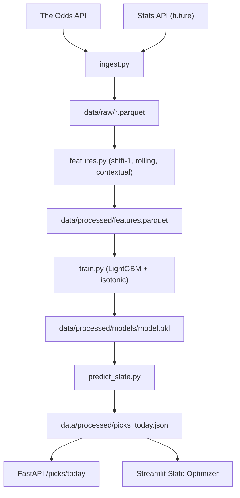

# DK-Picks-Optimizer — Development Plan

**Priority:** 1 (Flagship portfolio project)  
**Current state:** ~91% done · ~89/100  
**Target score:** 91/100  
**Timeline:** polish / live-data hookup

## Goal

Harden this **probabilistic performance forecasting** system into a production-grade, interview-proof portfolio flagship.

## Status Tracker

| Task | Status | Notes |
|------|--------|-------|
| CI/CD pipeline + badge | **DONE** | pytest + ruff, 80% coverage floor |
| README backtest table | **DONE** | Synthetic — run walk-forward for live numbers |
| Architecture mermaid diagram | **DONE** | README + pipeline flow below |
| Calibration plot PNG | **DONE** | `scripts/plot_calibration.py` → `docs/calibration_plot.png` |
| Streamlit Community Cloud deploy | **DONE** | `streamlit_app.py` |
| Professional framing / language | **DONE** | Slate Optimizer, allocation terminology |
| Tests (leakage, ECE, Kelly, API) | **DONE** | Root + `betting_system/tests/` |
| `docs/INTERVIEW.md` | **DONE** | 6 × 60s Q&As |
| Production evidence checklist | **DONE** | Artifact trail for real backtest + live feed proof |
| Market credibility plan | **DONE** | Phase plan for prediction-market recruiter proof |
| Edge Desk market edge audit | **DONE** | Durable fair-value log + `/markets/edge-summary` |
| Probability-to-capital layer | **DONE** | Order-book execution, trade ledger, money-weighted PnL attribution |
| SHAP dashboard panel | **DONE** | Model Health page |
| End-to-end pipeline orchestrator | **DONE** | `dk-pipeline --dry-run` |
| Contextual feature placeholders | **DONE** | `home_away`, `days_rest`, `back_to_back` |
| `betting_system/tests/` in CI | **DONE** | Unified testpaths, cov ≥ 80% |
| Docstrings + plan sync | **DONE** | Google-style on public pipeline/optimizer APIs |
| Test & validation hardening | **DONE** | Offline market smoke, optimizer guardrails, config validator |

## Remaining (optional polish)

- [ ] Replace synthetic README backtest rows with real walk-forward logs
- [ ] Live Odds API ingest in production (requires API key + stats feed)
- [ ] Streamlit Cloud URL in README badge (user-specific deploy)
- [ ] Decide whether `docs/DK_Picks_Optimizer_Project_Summary.pdf` and `scripts/generate_project_summary_pdf.py` are public artifacts; currently they are local working artifacts, not part of the tracked evidence trail

## Pipeline Data Flow

## Rules

- Run `pytest` after every change
- Run focused validation from [`docs/VALIDATION.md`](./VALIDATION.md) for pipeline, optimizer, or config changes
- No magic numbers — `betting_system/config.yaml`
- Google-style docstrings on public functions
- Do NOT add new ML model types

## Cursor Prompt

[`docs/CURSOR_PROMPT.md`](./CURSOR_PROMPT.md)
